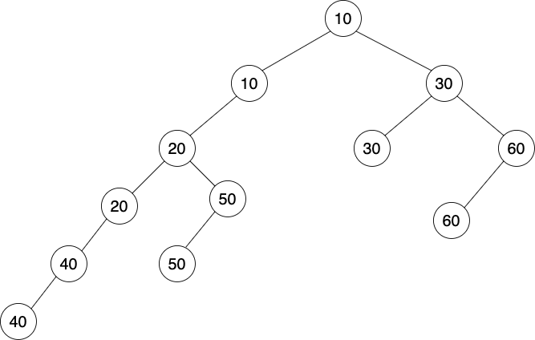

Problem statement
For a given a Binary Tree of type integer, duplicate every node of the tree and attach it to the left of itself.

The root will remain the same. So you just need to insert nodes in the given Binary Tree.

Example:

After making the changes to the above-depicted tree, the updated tree will look like this.

You can see that every node in the input tree has been duplicated and inserted to the left of itself.
Detailed explanation ( Input/output format, Notes, Images )
Input format :
The first and the only line of input will contain the node data, all separated by a single space. Since -1 is used as an indication whether the left or right node data exist for root, it will not be a part of the node data.
Output Format :
The updated tree will be printed in a level order fashion where each level will be printed on a new line.
Elements on every level will be printed in a linear fashion. A single space will separate them.
Note:
You are not required to print anything explicitly. It has already been taken care of. Just implement the function to achieve the desired structure of the tree.
Hint:
First, store the left node. Next, insert a duplicate node to the left of the current node. Then, call the function for the stored left node, which will return a modified node. Attach this modified node to the left of the duplicate node. Finally, proceed to call the function for the right node of the root
Constraints :
1 <= N <= 10^5
Where N is the total number of nodes in the binary tree.

Time Limit: 1 sec
Sample Input 1:
10 20 30 40 50 -1 60 -1 -1 -1 -1 -1 -1
Sample Output 1:
10
10 30
20 30 60
20 50 60
40 50
40
Sample Input 2:
8 5 10 2 6 -1 -1 -1 -1 -1 7 -1 -1
Sample Output 2:
8
8 10
5 10
5 6
2 6 7
2 7
